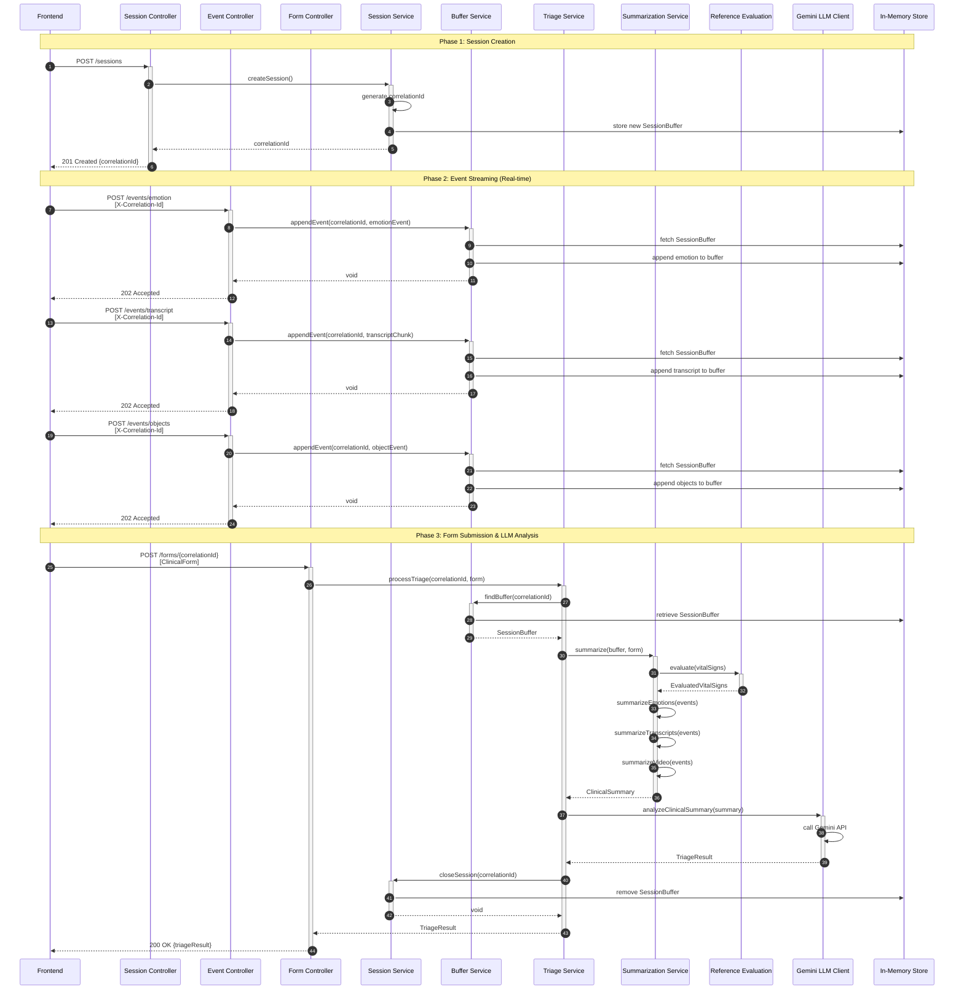
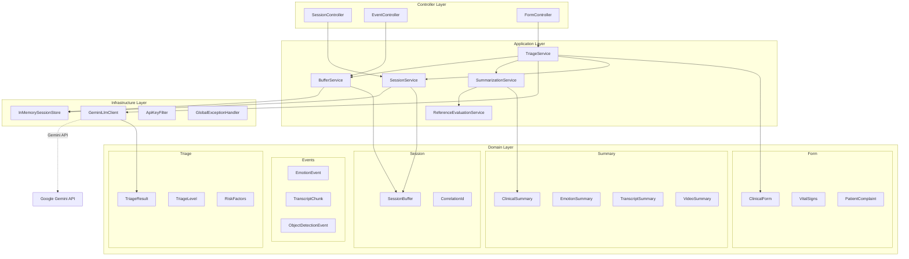
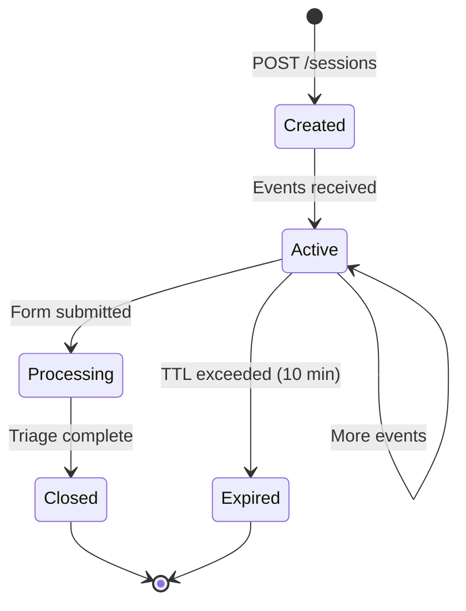

# Medical Triage System - MVP

> **Assisted Medical Triage with Real-time Event Processing and LLM Analysis**

A Spring Boot application that provides AI-assisted medical triage by combining real-time audio/video event streams with clinical forms to help medical professionals make informed decisions.

## 📋 Overview

This system implements an **event-driven architecture** for medical triage assistance. It:
- **Creates clinical sessions** with unique correlation IDs
- **Receives real-time events** (emotion detection, audio transcripts, object detection)
- **Buffers events in-memory** during the session
- **Processes clinical forms** to trigger final analysis
- **Uses LLM (Gemini)** to provide risk assessment and triage recommendations
- **Assists (not replaces)** trained medical professionals

> ⚠️ **Important**: The LLM does **not** make medical decisions. It only provides signals, risks, and observations to assist human professionals.

---

## 🔄 Dataflow - Sequence Diagram



---

## 🏗️ Architecture Structure



---

## 🚀 How to Run Locally

### Prerequisites

- **Java 21** or higher
- **Maven 3.8+**
- **Gemini API Key** (from [Google AI Studio](https://makersuite.google.com/app/apikey))

### 1. Clone the Repository

```bash
git clone <repository-url>
cd tech-fase-4
```

### 2. Configure Environment Variables

Copy the example environment file and configure it:

```bash
cp .env.example .env
```

Edit `.env` and set your API keys:

```properties
# Required
GEMINI_API_KEY=your-actual-gemini-api-key-here
TRIAGE_API_KEY=your-custom-api-key-for-client-requests

# Optional
PORT=8080
```

### 3. Build the Application

```bash
./mvnw clean install
```

Or on Windows:

```cmd
mvnw.cmd clean install
```

### 4. Run the Application

Using Maven:

```bash
./mvnw spring-boot:run
```

Or run the JAR directly:

```bash
java -jar target/medical-0.0.1-SNAPSHOT.jar
```

### 5. Access the Application

- **API Base URL**: `http://localhost:8080`
- **Swagger UI**: `http://localhost:8080/swagger-ui.html`
- **Health Check**: `http://localhost:8080/actuator/health`

---

## 🔐 API Authentication

All API endpoints (except health check) require authentication using the `X-API-Key` header:

```bash
curl -H "X-API-Key: your-custom-api-key-for-client-requests" \
     http://localhost:8080/sessions
```

---

## 📡 External API Dependency: Google Gemini

### Overview

This application integrates with **Google Gemini API** for AI-assisted triage analysis. The LLM analyzes aggregated clinical data and provides risk assessment.

### Configuration

The Gemini client is configured in [application.yaml](src/main/resources/application.yaml):

```yaml
gemini:
  api-key: ${GEMINI_API_KEY}
  model: gemini-2.5-flash
  system-prompt: |
    You are a medical triage assistant. Analyze the following 
    clinical summary and provide a triage assessment...
  output-schema: |
    {
      "type": "object",
      "properties": {
        "triageLevel": {"type": "string"},
        "riskFactors": {"type": "array", "items": {"type": "string"}},
        "inconsistencies": {"type": "array", "items": {"type": "string"}},
        "notesForPhysician": {"type": "string"},
        "confidence": {"type": "number"}
      }
    }
```

### How It Works

1. **Input**: The `GeminiLlmClient` receives a `ClinicalSummary` object containing:
   - Clinical form data (complaint, vital signs, medical history)
   - Emotion summary (dominant emotions, distribution)
   - Transcript summary (consolidated patient speech)
   - Video summary (detected objects)

2. **Processing**: 
   - Converts summary to JSON
   - Sends to Gemini API with structured output schema
   - Uses `gemini-2.5-flash` model for fast inference

3. **Output**: Returns a `TriageResult` with:
   - `triageLevel`: LOW | MEDIUM | HIGH
   - `riskFactors`: Array of identified risk factors
   - `inconsistencies`: Detected contradictions in data
   - `notesForPhysician`: Detailed observations
   - `confidence`: Confidence score (0.0 - 1.0)

### API Key Setup

1. Visit [Google AI Studio](https://makersuite.google.com/app/apikey)
2. Create or sign in to your Google account
3. Generate a new API key
4. Set the `GEMINI_API_KEY` environment variable

### Rate Limits & Costs

- **Free tier**: Check [Google Gemini Pricing](https://ai.google.dev/pricing)
- **Rate limits**: Varies by model and plan
- **Recommendation**: Implement caching or request throttling for production

### Fallback Strategy

The application includes a `MockLlmClient` for development/testing without API calls. Switch implementation in configuration if needed.

---

## 🧪 Testing

Run unit tests:

```bash
./mvnw test
```

View test results:

```bash
open target/surefire-reports/index.html
```

---

## 📊 Session Lifecycle



**Key Points:**
- Sessions have a **10-minute TTL** by default
- Sessions without form submission are **automatically cleaned up**
- After triage completion, sessions are **immediately removed** from memory

---

## 🛠️ Technologies

- **Java 21**
- **Spring Boot 3.5.9**
- **Spring Web** - REST API
- **Spring Actuator** - Health checks
- **Spring Validation** - Request validation
- **Google Gemini SDK** - LLM integration
- **SpringDoc OpenAPI** - API documentation
- **JUnit 5** - Testing

---

## 📂 Project Structure

```
src/main/java/com/tech_challenge/medical/
├── application/              # Business logic services
│   ├── BufferService.java
│   ├── ReferenceEvaluationService.java
│   ├── SessionService.java
│   ├── SummarizationService.java
│   └── TriageService.java
├── controller/              # REST endpoints
│   ├── EventController.java
│   ├── FormController.java
│   └── SessionController.java
├── domain/                  # Domain models (pure business logic)
│   ├── events/             # EmotionEvent, TranscriptChunk, etc.
│   ├── form/               # ClinicalForm, VitalSigns, etc.
│   ├── session/            # SessionBuffer, CorrelationId
│   ├── summary/            # ClinicalSummary, EmotionSummary, etc.
│   └── triage/             # TriageResult, TriageLevel, etc.
└── infrastructure/          # External integrations
    ├── config/             # Spring configuration
    ├── llm/                # GeminiLlmClient
    ├── security/           # ApiKeyFilter
    ├── store/              # InMemorySessionStore
    └── web/                # GlobalExceptionHandler
```

---

## 📝 API Endpoints

### Session Management

| Method | Endpoint | Description |
|--------|----------|-------------|
| POST | `/sessions` | Create a new clinical session |

### Event Ingestion

| Method | Endpoint | Description |
|--------|----------|-------------|
| POST | `/events/emotion` | Append emotion detection event |
| POST | `/events/transcript` | Append audio transcript chunk |
| POST | `/events/objects` | Append video object detection event |

### Form Submission

| Method | Endpoint | Description |
|--------|----------|-------------|
| POST | `/forms/{correlationId}` | Submit clinical form and trigger triage |

### Health & Monitoring

| Method | Endpoint | Description |
|--------|----------|-------------|
| GET | `/actuator/health` | Application health status |

---
